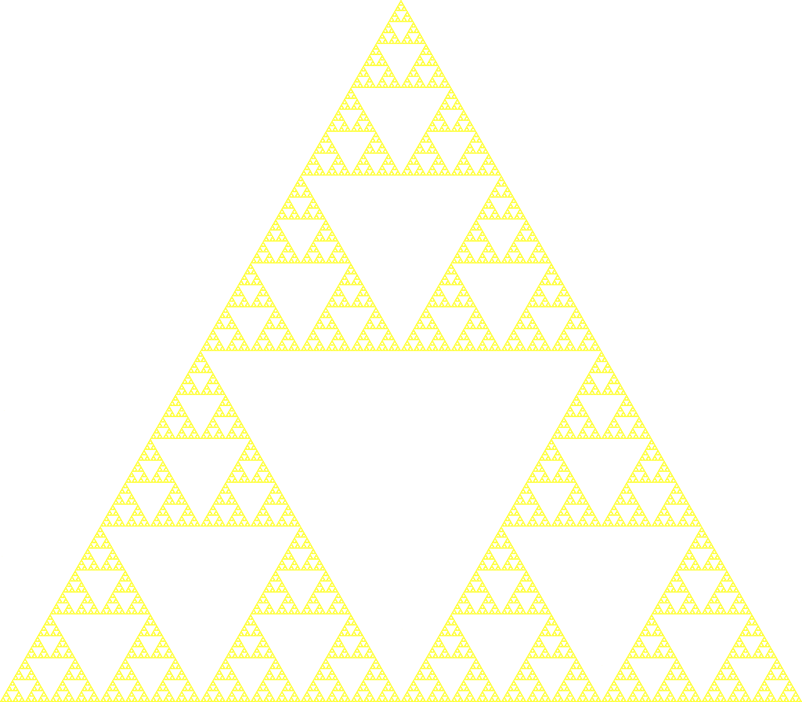
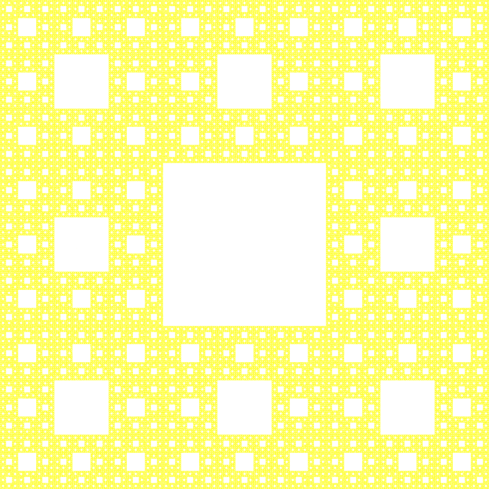

# Chaos-games

### What is a Chaos game?

A chaos game is a way of generating fractals through different itterative processes. By choosing a set of points and generating one random point in between the other points. If you then draw the midpoint between the coosen point and a random point in the set of points, and then use that midpoint in the next itteration of the process. The resulting fractals could look something like this:

                
