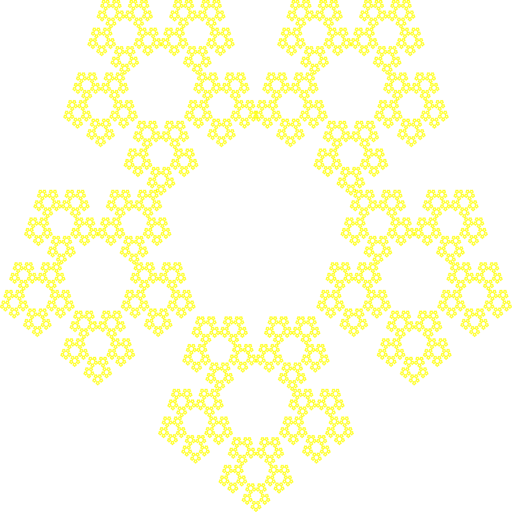
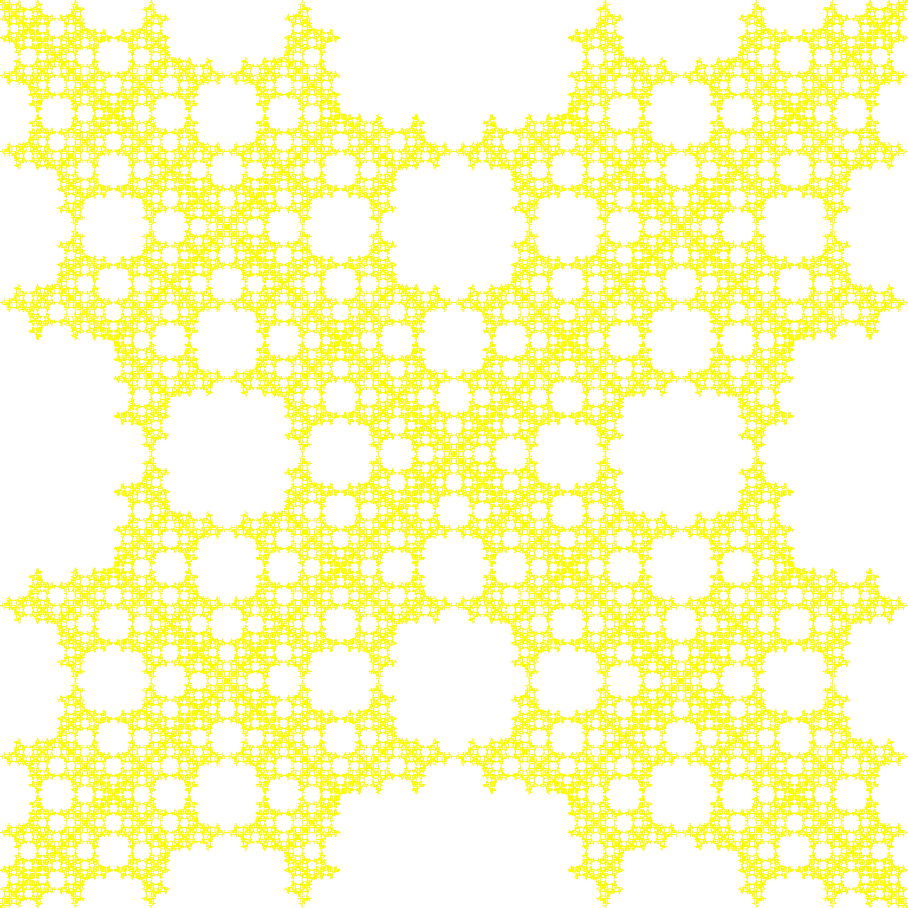

# Chaos-games

### What is a Chaos game?

A chaos game is a way of generating fractals through different itterative processes. By choosing a set of points and generating one random point in between the other points. If you then draw the midpoint between the coosen point and a random point in the set of points, and then use that midpoint in the next itteration of the process. The resulting fractals could look something like this:

In addition it is possible to create different patterns by imposing requirements on which points the algorithm is allowed to choose. For example the following fractal was created with the restriction that if the same point got choosen two times in a row the following point could not neighbour the repeating point:

Further reading: https://en.wikipedia.org/wiki/Chaos_game
