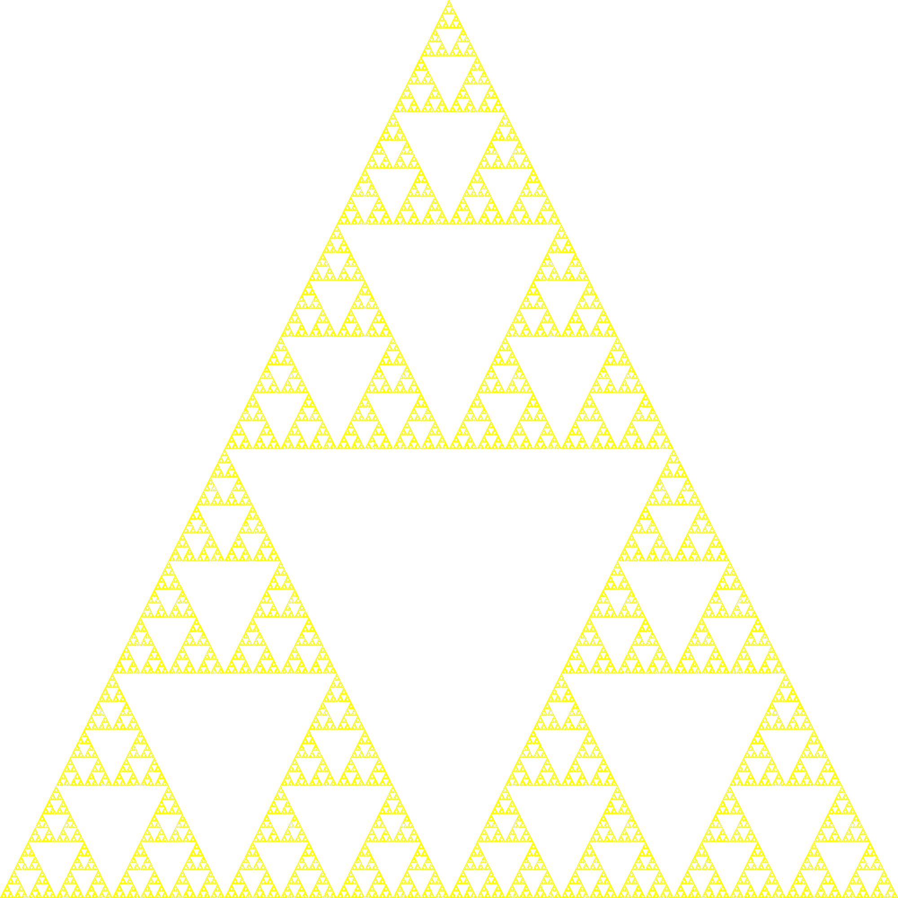
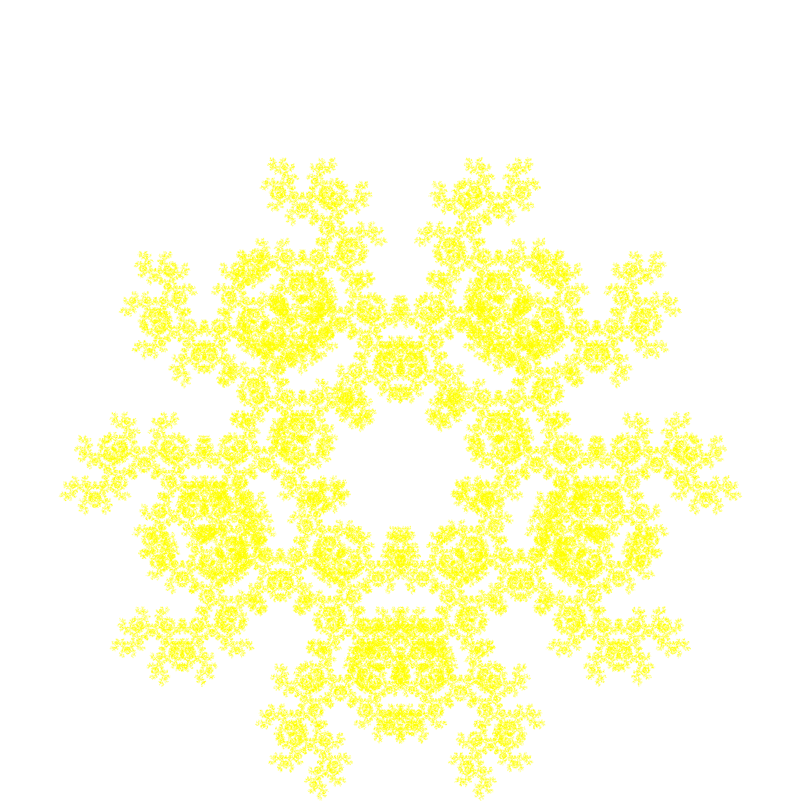
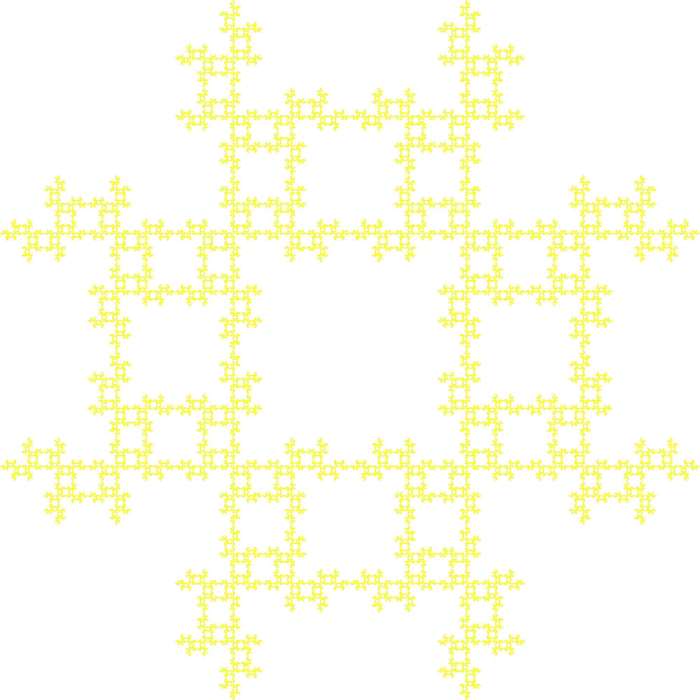

# Chaos-games

### What is a Chaos game?

A chaos game is a way of generating fractals through different iterative processes. By choosing a set of points and generating one random point in between the other points. If you then draw the midpoint between the chosen point and a random point in the set of points, and then use that midpoint in the next iteration of the process. The resulting fractals could look something like this:

In addition it is possible to create different patterns by imposing requirements on which points the algorithm is allowed to choose. For example the first of the following fractal was created as a square with the restriction that if the same point got chosen two times in a row the following point could not neighbor the repeating point. The other two were created with the restriction that the same point couldn't be picked two times in a row.

### Generalising with affine transformations
These algorithms use affine transformation to create self similar shapes. By fine tuning these transformations we can create many fascinating fractals such as the Barnsley Fern 

Further reading: 
https://en.wikipedia.org/wiki/Chaos_game
https://en.wikipedia.org/wiki/Barnsley_fern

